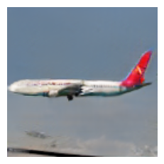
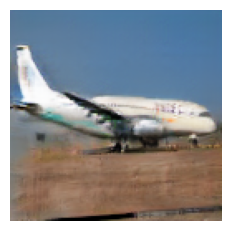

# Modelo generativo (DCGAN) para imágenes de aviones

  <a href="README.md">English</a> |
  Español

Deep Convolutional Generative Adversarial Network (DCGAN) que genera imágenes de aviones. Proyecto desarrollado para la asignatura Redes Neuronales Artificales del máster MUIARFID (UPV).

Se ha utilizado como base el código proporcionado por [Erik Linder-Norén (2018)](https://github.com/eriklindernoren/Keras-GAN/blob/master/dcgan/dcgan.py) en su implementación de una DCGAN en Keras.

A continuación se muestran algunas de las mejores imágenes generadas al final del
entrenamiento.

  
   
  

# Dataset

Se ha utilizado el dataset [Fine-Grained Visual Classification of Aircraft (FGVC-Aircraft)](https://www.robots.ox.ac.uk/~vgg/data/fgvc-aircraft/). Las imágenes han sido redimensionadas a 128x128 píxeles.

# Modelos

-   **Discriminador:** El modelo discriminador está compuesto por una serie de
    5 capas convolucionales y 1 capa de salida con una única neurona con
    función de activación sigmoide para indicar en qué grado la imagen
    es real (1) o falsa (0).\
    Las capas convolucionales reducen las dimensiones de la imagen de
    128x128 a 8x8 (strides=2) a la vez que amplían el número de filtros
    de 32 a 512.\
    El optimizador utilizado ha sido Adam con learning rate fijo.

-   **Generador:** El modelo generador está implementado de forma
    simétrica al discriminador pero tomando por entrada un punto del
    espacio latente de 64 dimensiones, seguido de una capa densa de
    512\*8\*8 neuronas. Después se concatenan 5 bloques de reescalado
    (doblando el tamaño) + capa convolucional (reduciendo a la mitad el número de filtros)
    + función de activación ReLU. La salida de esta serie de bloques
    será una imagen convolucional de 128x128 píxeles y 32 filtros a la
    que se le aplica una capa convolucional final encargada de convertir
    los 32 filtros en los 3 canales de color de la imagen. El rango de
    los valores de color de esta salida será \[-1,1\] dado que usamos la
    función de activación tanh después de aplciar esta últica capa
    convolucional.\
    Este modelo nunca se va a entrenar por sí solo, sino como submodelo
    del modelo GAN por lo que no requiere de un optimizador.

-   **GAN:** Este modelo se compone de una concatenación de los modelos
    generador y discriminador pero marcando el modelo discriminador como
    no entrenable (dado que se entrenará por separado).\
    De nuevo, el optimizador utilizado ha sido Adam con learning rate
    fijo.

# Entrenamiento

Se ha utilizado un batch de 64 imágenes y se ha establecido un límite de 200 epochs midiendo la precisión del discriminador y generando una matriz de imágenes falsas cada 10 epochs.\
A las imágenes reales de cada batch se les hacía data augmentation utilizando la librería [Albumentations](https://github.com/albumentations-team/albumentations). En
concreto, se aplicaron las siguientes transformaciones:

-   Volteado horizontal en una probabilidad del 50%.

-   Traslación vertical y horizontal (±5%).

-   Rotación (±10º).

-   Escalado (±5%).

Una vez el batch está cargado, primero entrenamos el discriminador 2
veces, una con imágenes reales (y=1) y otra con imágenes falsas (y=0).\
Después entrenamos el modelo GAN. Este modelo recibe como muestra de
entrada (x) un punto del espacio latente y una clase (y) que siempre es
1 (real). De este modo, el generador genera una imagen falsa que sirve
de entrada al discriminador. Si el discriminador la marca como falsa
(y= 0), se habrá producido un error de clasificación (al esperarse una
salida y=1) que propagará el error haciendo que la red vaya aprendiendo
a generar imágenes realistas que puedan sortear cada vez mejor al
discriminador.

# Evaluación y resultados

Para evaluar el discriminador se mide la precisión con la que clasifica
las imágenes entre reales o falsas. El generador, por otro lado, se
evalúa de forma subjetiva observando una matriz de imágenes falsas
generadas a partir de puntos aleatorios del espacio latente.

## Discriminador

Las siguiente figura muestran cómo evoluciona el discriminador con el
paso de las epochs. Claramente se puede apreciar que el loss del
clasificador baja de forma constante mientras que el loss del generador
no para de aumentar. Además el discriminador apenas falla al detectar
imágenes falsas durante todo el entrenamiento. Estos son indicativos de
que la red no converge, un [problema común en redes GAN](https://machinelearningmastery.com/practical-guide-to-gan-failure-modes/).\
Sin embargo, el generador ha logrado producir varias imágenes realistas
en las últimas epochs del entrenamiento.

![Evolución del loss del generador y del discriminador.[\[long\]]{#long
label="long"}](images/loss.png)

![Evolución de la precisión del discriminador.[\[long\]]{#long
label="long"}](images/acc.png)

## Generador

La gran mayoría de las imágenes del dataset incluyen
fotos centradas de aviones blancos vistos de perfil y este patrón es
claramente visible a partir de la epoch 20. En la epoch 100 se alcanzan
resultados prometedores aunque genera imágenes que parecen espejadas
horizontalmente y otras que no son distinguibles. A partir de la epoch
150 se alcanzan resultados satisfactorios aunque la calidad de las
imágenes mejora poco después de ese punto. Por otro lado, las imágenes
generadas presentan una variedad coherente con la variedad en las
imágenes del dataset, indicando que la red no sufre un colapso modal.

# Mejoras

Inicialmente tanto en la ampliación realizada en el generador como en la
reducción del discriminador, se llegaba a trabajar con imágenes de 4x4
píxeles. Esto resultaba en un colapso modal ya desde las primeras
epochs. Este efecto se minimizó eliminando estas capas extra de los
modelos.\
Sin embargo, con esta implementación no se alcanza una convergencia. La
calidad de las imágenes producidas por el generador es satisfactoria
pero el loss del generador sigue una tendencia ascendente. Una posible
mejora sería utilizar imágenes de cada vez más resolución, de forma
progresiva, durante el entrenamiento tanto del generador como del
discriminador ([Progressive Growing GAN](https://machinelearningmastery.com/introduction-to-progressive-growing-generative-adversarial-networks/)).\
Además convendría realizar la evaluación del generador usando una
métrica, como la Distancia Inicial de Frechlet (FID), en lugar de
realizar esta evaluación de forma subjetiva.

# Licencia

[MIT](LICENSE)
