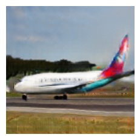
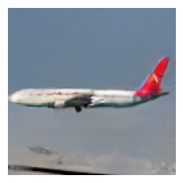
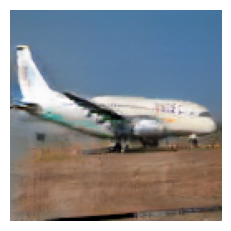

# Generative model (DCGAN) for airplane images

  English |
  <a href="README.es-ES.md">Español</a>

Deep Convolutional Generative Adversarial Network (DCGAN) that generates aircraft images. Project developed for the course Artifical Neural Networks of the master MUIARFID (UPV).

The code provided by [Erik Linder-Norén (2018)](https://github.com/eriklindernoren/Keras-GAN/blob/master/dcgan/dcgan.py) in his implementation of a DCGAN in Keras has been used as a basis for this project.

Below are some of the best images generated at the end of the training.

  
   
  

# Dataset

The dataset [Fine-Grained Visual Classification of Aircraft (FGVC-Aircraft)](https://www.robots.ox.ac.uk/~vgg/data/fgvc-aircraft/) has been used to train this model. The images have been resized to 128x128 pixels.

# Models

-   **Discriminator:** The discriminator model is composed of a series of 5 convolutional layers and 1 output layer with a single neuron. Sigmoid activation function has been used to indicate to what degree the image is true (1) or false (0). The convolutional layers reduce the image dimensions from 128x128 to 8x8 (strides=2) while expanding the number of filters from 32 to 512. The optimizer used has been Adam with fixed learning rate.

-   **Generator:** The generator model is implemented symmetrically to the discriminator but taking as input a point in the 64-dimensional latent space, followed by a dense layer of 512*8 neurons. Then 5 concatenated blocks of upsampling (doubling the size) + convolutional layer (reducing to half the number of filters) + ReLU activation layer. The output of this series of blocks will be a convolutional image of 128x128 pixels and 32 filters to which a final convolutional layer is applied to convert the 32 filters into the 3 color channels of the image. The range of the color values of this output will be \[-1,1] since we use the activation function tanh after applying this last convolutional layer. This model will never be trained by itself, but as a submodel of the GAN model so it does not require an optimizer.

-   **GAN:** This model is composed of a concatenation of the generator and discriminator models but marking the discriminator model as untrainable (since it will be trained separately). Again, the optimizer used has been Adam with fixed learning rate.

# Training

A batch of 64 images was used and a limit of 200 epochs was set. Every 10 epochs the accuracy of the discriminator is measured and a matrix of false images is shown.\
The real images of each batch were data augmented using the [Albumentations](https://github.com/albumentations-team/albumentations) library. Specifically, the following transformations were applied:

-   Horizontal flip (probability=50%).

-   Width and height shift (±5%).

-   Rotation (±10º).

-   Zoom (±5%).

Once the batch is loaded, we first train the discriminator 2 times, once with real images (y=1) and once with fake images (y=0). Then we train the GAN model. This model receives as input sample (x) a point in the latent space and a class (y) that is always 1 (real). In this way, the generator generates a false image that serves as input to the discriminator. If the discriminator marks it as false (y=0), a classification error will have occurred (as an output y=1 is expected), which will propagate the error, causing the network to learn how to generate realistic images that can confuse the discriminator.

# Evaluation and results

To evaluate the discriminator, we measure the accuracy with which it classifies images as real or fake. The generator, on the other hand, is evaluated subjectively by observing a matrix of false images generated from random points in the latent space.

## Discriminator

The following figure shows how the discriminator evolves with the passing of epochs. It can be clearly seen that the loss of the classifier decreases steadily while the loss of the generator increases steadily. Moreover, the discriminator hardly fails to detect false images during the whole training. These are indicative of the network not converging, a [common problem in GAN networks](https://machinelearningmastery.com/practical-guide-to-gan-failure-modes/).\ However, the generator has managed to produce several realistic images in the final epochs of the training.

![Loss evolution for generator and discriminator.[\[long\]]{#long
label="long"}](images/loss.png)

![Accuracy evolution for generator and discriminator.[\[long\]]{#long
label="long"}](images/acc.png)

## Generator

The vast majority of the images in the dataset include centered photos of white aircraft viewed in profile and this pattern is clearly visible from epoch 20 onwards. At epoch 100, promising results are achieved although it generates images that appear horizontally mirrored and others that are indistinguishable. From epoch 150 onwards, satisfactory results are achieved although the quality of the images improves shortly after that point. On the other hand, the generated images present a variety coherent with the variety in the images of the dataset, indicating that the network does not suffer a modal collapse.

# Future work

The quality of the images produced by the generator is satisfactory but the loss of the generator follows an upward trend. A possible improvement would be to use progressively higher resolution images during the training of both the generator and the discriminator ([Progressive Growing GAN](https://machinelearningmastery.com/introduction-to-progressive-growing-generative-adversarial-networks/)). It would also be useful to evaluate the generator using a metric, such as the Frechlet Initial Distance (FID), rather than performing this evaluation subjectively.

# Licencia

[MIT](LICENSE)
